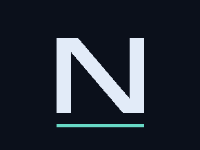

<p align="center"></p>

# Noir Syncplay for Roku

A **Roku fork/port of [syncplay-noir](https://github.com/neura-neura/syncplay-noir) and [noir-player](https://github.com/neura-neura/noir-player)**: a native BrightScript/SceneGraph channel plus a Python bridge. This is a combined adaptation, not a GitHub fork with two upstream parents. It preserves Syncplay/Noir interoperability and adapts Noir subtitle customization to Roku; it does not run the Windows player on the TV.

[Download the channel](https://github.com/neura-neura/syncplay-roku/releases/latest) · [AI installation prompt](docs/AI-INSTALL.md) · [Server maintenance](docs/SERVER.md) · [Validation and limitations](docs/VALIDATION.md)

## What it does

- Synchronize playback, pause and seeking with a Syncplay room and Noir clients.
- Browse SMB, FTP and explicit FTPS libraries; select video and subtitles independently.
- Persist server, room, credentials, libraries, selected files and subtitle styling.
- Remote-control playback with a five-second information bar, shared playlists, readiness, optional countdown, chat and managed-room authentication.
- Direct playback when Roku supports the codecs; optional remux/transcode for compatibility.
- SRT/ASS/SSA/VTT text subtitles, overlapping cues, offset and Chinese/Japanese/Korean fallback.
- All Noir subtitle appearance fields: family, size, weight, text/background colors, opacity, bottom position, automatic/custom width, padding, radius, line height, letter spacing and shadow.
- GothamPro bundled from Noir Player; import other fonts through CSS `@font-face` (TTF/OTF/WOFF/WOFF2), with live preview and persistent downloads.
- Browser pairing through a single-use code shown on Roku. No need to type the permanent bridge token into a browser.

**This public repository and its release ZIP contain no personal IP addresses, passwords, room selections or bridge token.** The channel UI currently uses Spanish labels; installation and maintenance instructions are in English.

## Architecture and requirements

```text
Roku TV ── HTTP ── Bridge ── SMB / FTP / FTPS ── Media library
                    │
                 Syncplay server ── Other Syncplay / Noir clients
```

The bridge must stay running and be reachable from Roku. It can run on the Syncplay server, a NAS, Windows, Linux or macOS. One bridge instance supports one Roku; use separate data directories, ports and usernames for multiple TVs.

You need:

- A Roku with developer mode enabled and its IP/developer password. Sideloading replaces the single developer-channel slot.
- Python 3.11+ and FFmpeg/FFprobe with libass, **or Docker with Compose** for the bridge.
- A reachable Syncplay server (host, port, room, username and optional password).
- A media server (protocol, host, port, SMB share if applicable, username/password, root folder).
- Node.js/npm only if you want to validate BrightScript locally; not required to build the ZIP with Python.

Enable Roku developer mode using **Home ×3, Up ×2, Right, Left, Right, Left, Right**. Follow the on-screen setup, set a password, and visit `http://ROKU_IP`. The developer username is normally `rokudev`. See [Roku developer setup](https://developer.roku.com/docs/developer-program/getting-started/developer-setup.md).

## Classic installation

### 1. Clone and configure

```sh
git clone https://github.com/neura-neura/syncplay-roku.git
cd syncplay-roku
```

Install FFmpeg first (for example `brew install ffmpeg` on macOS or `sudo apt install ffmpeg python3-venv` on Debian/Ubuntu).

macOS/Linux:

```sh
sh scripts/setup.sh
```

Windows PowerShell (install Python and FFmpeg and add them to PATH first):

```powershell
powershell -ExecutionPolicy Bypass -File scripts/setup.ps1
```

The wizard writes `.local/config.json` and creates a random permanent bridge token. Enter the **bridge host's address reachable from Roku**, such as `http://YOUR_BRIDGE_HOST:8787`, not `localhost` unless Roku itself could reach that name. SMB host and share are separate fields; `/Movies/example.mkv` is relative to the share, not a Windows drive path. Blank passwords preserve previously saved credentials. Additional sources and TLS can be configured in the web panel.

### 2. Start the bridge

macOS/Linux:

```sh
.venv/bin/python scripts/run_bridge.py
```

Windows:

```powershell
.venv\Scripts\python.exe scripts\run_bridge.py
```

Allow TCP 8787 from Roku and your management devices through the host firewall. Check `http://YOUR_BRIDGE_HOST:8787/health`. For a remote bridge, run these commands on that host; the Mac/PC used to install the channel need not remain on.

**Docker alternative:** no local FFmpeg/Python installation is needed for the bridge:

```sh
docker compose build
```

Configure with explicit mounts so settings persist on the host:

```sh
docker compose run --rm -v "$PWD/.local:/app/.local" -v "$PWD/scripts:/app/scripts:ro" bridge python scripts/configure.py
cp .env.example .env
# Edit .env: set BRIDGE_BIND_IP to this server's LAN address.
docker compose up -d
```

The explicit-mount configuration writes to the host; `.local/config.json` is shared with the running service at `/data/config.json`. See [server maintenance](docs/SERVER.md) for backups and upgrades.

### 3. Install the Roku channel

Build a paired ZIP on the machine holding the bridge configuration:

```sh
python3 scripts/package.py --paired --config .local/config.json
```

On Windows use `py -3` instead of `python3`. This outputs `dist/noir-roku-paired.zip` with your bridge URL/token. Keep it private. Upload it through `http://ROKU_IP` → **Upload / Install**, or use:

```sh
.venv/bin/python scripts/deploy.py ROKU_IP dist/noir-roku-paired.zip
```

The deployment script prompts for the Roku password; automation can use `ROKU_PASSWORD`. If your bridge is remote, securely copy its config to an ignored local path and pass `--config PATH`; do not commit it.

Alternatively download **noir-roku.zip** from Releases, install it through Roku's developer page, then enter your bridge URL and `token` from `.local/config.json` in **Configuración → URL del puente / Clave fija del puente**. This generic ZIP intentionally starts unpaired.

### 4. Open the panel and play

On Roku select **Configuración → Vincular navegador**. Open the displayed URL and enter the six-digit code. It expires after five minutes or five failed attempts and works once. The browser then remembers access and loads saved settings. The permanent token does not expire. Password fields remain empty for privacy; they are still saved.

If you have the config locally, `python scripts/open_panel.py` also opens an authenticated panel.

Select **Elegir video**, select a source and file, then **Elegir subtítulos**, and **Abrir / reproducir selección**. If the room is paused, press Play. **Estoy listo** marks readiness. Changes to audio track, subtitle offset or video mode require reopening the selection; appearance changes apply live.

## AI-assisted installation (alternative)

Copy the complete prompt in **[docs/AI-INSTALL.md](docs/AI-INSTALL.md)** into Codex or another coding agent with terminal access. It gathers the specific network/service details, installs dependencies, writes a private configuration, starts the bridge, builds and installs a paired channel, and verifies the result. Developer-mode activation and unavailable credentials still require you; it must not guess them.

## Remote controls

| Button | Action |
|---|---|
| Play / OK | Pause/resume; OK confirms a pending seek |
| Left / Right | Seek ±10 seconds |
| Rewind / Fast-forward | Seek ±30 seconds |
| Replay | Back 10 seconds |
| Up / Down | Show/hide playback information |
| Back / Options | Pause and open menu |
| Home | Exit channel |

Volume and mute remain TV controls. Consecutive seek presses accumulate. Sync correction uses seeks, not variable playback speed.

## Subtitle defaults and fonts

Defaults match Noir: GothamPro, 38 px, weight 500, white text, black box at 23% opacity, bottom 4%, automatic width (78% when custom width is enabled), padding 12/8 px, radius 8 px, line height 1.18, letter spacing 0.2 px, shadow on. Sizes use Roku's 1920×1080 scene as reference.

In **Fuentes por CSS**, enter a stylesheet URL, click **Cargar fuentes CSS**, then choose the family. Relative URLs and Unicode subsets are supported. Static fonts use the closest available weight; variable fonts are instantiated at the selected weight. Fonts stay on the bridge. Installed-font choices refer to the bridge host, not your browser computer. Gotham is supplied as in the upstream repository; retained font metadata and upstream license notices are in `bridge/fonts/`.

Roku does not execute CSS. The bridge renders small transparent subtitle PNGs, and Roku overlays them and preloads the next cue. **The movie is not decoded or transcoded for text styling.** Preview uses the same renderer. This is an adaptation of Noir's parameters, not pixel-identical browser CSS or arbitrary CSS execution. ASS positioning/animations are not preserved in text mode; optional burn-in preserves libass styling but requires video transcoding.

## Storage, security and maintenance

- `.local/config.json`: private settings and passwords; never commit or publish it.
- `.local/fonts/`: imported fonts and catalog; back up with the config.
- `.local/media/`: prepared media, subtitle timelines and generated images.
- Subtitle PNG cleanup runs at startup and hourly: 7 days unused, 256 MiB target, least recently used first. A 10-minute active-use grace can temporarily exceed that target.
- Prepared videos, downloaded fonts and text subtitle files are **not** automatically deleted. Stop the bridge before manually clearing media cache; it can be rebuilt.
- HTTP and FTP do not encrypt traffic. Use a trusted LAN/VPN; do not expose the bridge directly to the Internet. FTPS and Syncplay certificate-validated TLS are available.
- Pairing does not discover hosts or cross NAT. A changed bridge address must be updated in Roku and `public_url`.
- Back up config and fonts before upgrades. Keep private paired ZIPs and credential backups out of public releases.

See [server maintenance and recovery](docs/SERVER.md).

## Development and verification

```sh
python3 -m venv .venv
.venv/bin/pip install -r requirements-dev.txt
npm ci
.venv/bin/python -m pytest -q
npm run check
python3 scripts/package.py
```

Tests cover Syncplay protocol behavior, FTP/ranges, authentication, pairing, persistence, FFmpeg pipelines, font import, Unicode rendering and cache retention. `scripts/live_sync_test.py ROKU_IP` is optional and **changes playback in the room**. [Validation notes](docs/VALIDATION.md) distinguish physical-device checks from automated tests.

## Credits and license

Fork/port origins: [syncplay-noir](https://github.com/neura-neura/syncplay-noir) for Syncplay/Noir compatibility and [noir-player](https://github.com/neura-neura/noir-player) for subtitle customization/defaults and font assets. This repository's original code is Apache-2.0; third-party assets retain their respective notices. See [LICENSE](LICENSE), [NOTICE](NOTICE), Noto's SIL OFL and the retained upstream Noir license. Not affiliated with Roku.
